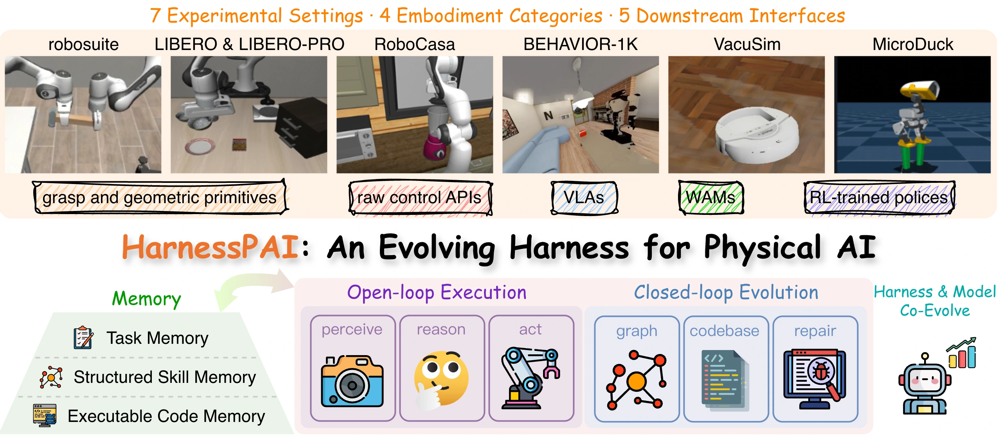
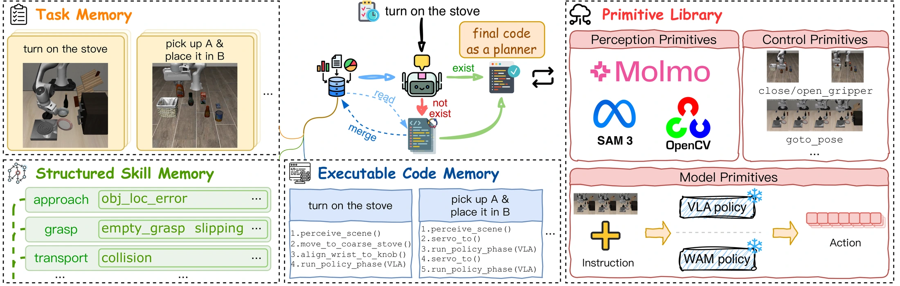

<div align="center">

<h1>HarnessPAI</h1>
<h3>An Evolving Harness for Physical AI</h3>
<p><strong>面向物理智能的可演化 Harness 框架</strong></p>

<p><strong>执行程序 · 从结果中学习 · 持续演化 Harness 和 模型</strong></p>
<p>Darwin Agent Team</p>

<p>
  <a href="https://darwin-agent.github.io/HarnessPAI/"></a>
  <a href="https://arxiv.org/abs/2609.29166"></a>
  
</p>

<p>
  <a href="https://darwin-agent.github.io/HarnessPAI/">项目主页</a> •
  <a href="https://arxiv.org/abs/2609.29166">论文</a> •
  <a href="#overview">项目概览</a> •
  <a href="#architecture">框架设计</a> •
  <a href="#results">实验结果</a> •
  <a href="#release-status">发布状态</a> •
  <a href="README.md">English</a>
</p>

</div>

<a id="overview"></a>
## 🔭 项目概览

> **物理智能不仅取决于动作模型，也取决于组织、验证和改进其行为的可执行系统。**

**HarnessPAI** 是一个不绑定特定模型或机器人形态的物理智能（Physical AI）Harness 框架。它以**代码作为可执行、可演化的接口**，协调感知、几何推理、动作原语与执行检查，而不是让动作模型独自承担完整任务。

框架将任务执行与程序改进划分到两个时间尺度：

- **单次执行内：运行固定程序。** 任务程序负责目标定位、感知与动作原语调用，并在进入下一步前检查执行结果。程序一旦选定，执行过程无需在线高层 LLM 逐步推理。
- **多次执行间：基于反馈演化。** 编程智能体利用执行反馈诊断失败、修改候选程序，并在验证通过后将其纳入可复用的代码库。
- **持续复用已有经验。** 结构化技能记忆为后续任务保存“失败—修复”经验，成功轨迹还可作为下游模型训练的示范数据。

<p align="center">
  
</p>

### 核心亮点

- 🧩 **统一框架，多种后端。** 在七个实验设置中，评估了视觉—语言—动作模型（VLA）、世界动作模型（WAM）、抓取原语、直接控制 API 和 PPO 训练策略等不同后端。
- 🎯 **不重训动作模型，也能提升任务完成率。** 主实验中，相比对应基础模型，LIBERO-PRO 成功率提升 **61.6 个百分点**，RoboCasa Atomic-Seen 成功率提升 **27.2 个百分点**。
- 🧠 **可复用的修复经验。** 技能按工作流节点组织，并引用统一维护的代码实现，而不是在相互独立的技能笔记中重复存放可执行代码。
- 🔁 **从任务执行走向模型训练。** 在独立的下游实验中，使用 Harness 成功轨迹微调 π₀.₅-LIBERO，使其 LIBERO-PRO 成功率提升 **38.8 个百分点**。


<a id="architecture"></a>
## 🏗️ 框架设计

<p align="center">
  
</p>

### 记忆与原语

| 组件 | 作用 |
| --- | --- |
| **任务记忆（Task Memory）** | 保存已知任务描述，支持检索此前演化得到的程序。 |
| **结构化技能记忆（Structured Skill Memory）** | 围绕接近、抓取、搬运等工作流节点，组织失败原因与修复方法。 |
| **可执行代码记忆（Executable Code Memory）** | 保存经过验证的任务程序，以及修复技能所引用的具体实现。 |
| **原语库（Primitive Library）** | 提供可由任务程序组合调用的感知、几何控制与学习型动作能力。 |

### 执行、诊断、修复、验证

1. **检索或构建任务程序。** 对已知任务复用经过验证的代码；对于新任务，结合任务指令、环境信息、成功条件与相关技能构建候选程序。
2. **运行固定程序。** 协调目标定位、运动控制、学习型动作与预设检查。例如，在 LIBERO 的混合执行流程中，代码负责定位、接近和搬运，VLA 负责抓取与放置。
3. **在多次执行之间利用反馈。** 分析诊断信息与执行视频，检索匹配的修复技能，并修改隔离的候选版本。未经验证的改动不会覆盖已验证的代码库。
4. **验证并沉淀经验。** 将通过规定验证的候选程序纳入代码库，并把可复用的修复经验整合进技能记忆。

从示范视频提取工作流图、评估动作模型能力、初始化感知模块，均属于**可选准备步骤**，根据任务需求和已有输入启用。

> **“开环”指程序级开环，不代表忽略环境反馈。** 单次执行期间程序保持不变，但仍可使用实时观测、反馈控制、预设检查与恢复逻辑；程序修改发生在多次执行之间。无需在线高层 LLM 推理，也**不等于**无需感知或动作模型推理。

完整框架与演化机制见**[论文](https://arxiv.org/abs/2609.29166)第 4 节**。


<a id="results"></a>
## 📊 实验结果

### 主要任务完成率

成功率单位为 **%**，提升幅度为**绝对百分点（pp）**。Harness 演化期间，动作后端保持冻结。

| 基准 / 评估子集 | 对比方法 | 对比成功率 | HarnessPAI | 提升 | 论文位置 |
| --- | --- | ---: | ---: | ---: | --- |
| **LIBERO** — Spatial、Object、Goal | π₀.₅-LIBERO | 96.9 | **98.1** | **+1.2 pp** | 表 4 |
| **LIBERO-PRO** — 三个任务套件 × Swap / Task | π₀.₅-LIBERO | 34.9 | **96.5** | **+61.6 pp** | 表 7 |
| **RoboCasa Target50** — Atomic-Seen，18 个任务 | WorldDreamer | 65.0 | **92.2** | **+27.2 pp** | 表 5 |
| **robosuite** — 七个操作任务 | ASPIRE | 81.0 | **96.3** | **+15.3 pp** | 表 6 |

**评估说明。** LIBERO 与 LIBERO-PRO 每个任务使用 50 个种子进行评估，其中包含程序演化使用的 15 个种子和额外的 35 个种子。RoboCasa 中的 WorldDreamer 与 HarnessPAI 使用相同的 20 种子评估设置。robosuite 的 ASPIRE 基线结果引自已有工作，并非固定相同后端的受控消融实验。完整协议、逐任务结果及不同对比方法的设置差异请参阅论文。

### 七个实验设置

| 实验设置 | 机器人形态 / 任务 | 论文使用的后端 |
| --- | --- | --- |
| **robosuite** | 单臂与双臂操作 | GraspNet |
| **LIBERO** | 语言条件下的桌面操作 | π₀.₅-LIBERO |
| **LIBERO-PRO** | 物体位置与指令扰动下的操作 | π₀.₅-LIBERO；迁移实验使用 DreamZero |
| **RoboCasa** | 移动操作机器人的家务任务 | WorldDreamer |
| **BEHAVIOR-1K** | 家庭环境导航与物体拾取 | GraspNet |
| **VacuSim** | 扫地机器人的清洁与覆盖 | 直接控制 API |
| **MicroDuck** | 足式运动与侧向漂移修正 | PPO 训练的 Walker 策略 |

不同设置使用与任务目标对应的指标，包括操作成功率、导航与拾取完成率、清洁覆盖率和运动误差，不将这些指标合并为单一总分。

### 主结果之外

- **跨模型迁移。** 将基于 π₀.₅ 在 LIBERO-Object 上演化得到的 Harness 原样迁移至 DreamZero。在 LIBERO-PRO Object 套件中，Swap 扰动下的成功率从 **0.6% 提升至 73.4%**，Task 扰动下从 **9.6% 提升至 84.4%**，无需重新演化 Harness（表 15）。
- **降低在线推理开销。** 在 LIBERO-Goal Task 1 上，相比所评估的串行 Harness VLA 基线，串行执行在 **Swap 下加速 23.1 倍**、在 **Task 下加速 18.4 倍**（图 21）。这是特定任务上的测量结果，不是所有基准的平均加速比。固定程序无需支付在线高层 LLM API 调用费用，但感知、动作推理、仿真、硬件与程序开发仍有成本。
- **为模型后训练提供轨迹。** 在**独立实验**中，使用环境成功判定筛选 Harness 轨迹，并据此微调 π₀.₅-LIBERO，使 LIBERO-PRO 成功率从 **34.9% 提升至 73.7%（+38.8 pp）**。该结果取 30,000 个训练步内的最佳检查点；每个任务的种子 0–39 用于额外训练数据采集，种子 40–49 留作评估（第 5.6 节）。该实验没有围绕微调后的模型再次演化 Harness。

更多视频、定性对比与分析请访问**[项目主页](https://darwin-agent.github.io/HarnessPAI/)**。

### 适用范围

HarnessPAI 面向能够开发、验证并复用程序的**重复任务场景**。效果依赖于感知质量、可用的动作原语、可检查的成功条件与演化预算。它组织已有的物理能力，而不是凭空补足缺失的底层技能；本文也未将其验证为通用于所有未见任务的一次性求解方案。


<a id="release-status"></a>
## 🚧 发布状态

| 资源 | 当前状态 |
| --- | --- |
| 项目主页与演示 | **已提供** |
| 论文 PDF | **已提供** |
| 研究代码 | **正在整理，尚未公开** |
| 安装与实验复现说明 | **暂未提供** |

当前仓库是**论文与项目主页展示仓库**，尚不是可安装的框架发行版。代码发布进展将在此更新；现阶段不提供临时安装命令或未经验证的 API 示例。


<a id="paper-and-citation"></a>
## 📄 论文与引用

**HarnessPAI: An Evolving Harness for Physical AI**<br/>
Darwin Agent Team

**[阅读论文](https://arxiv.org/abs/2609.29166)** · **[访问项目主页](https://darwin-agent.github.io/HarnessPAI/)**

```bibtex
@article{wang2026harnesspai,
  title   = {{HarnessPAI}: An Evolving Harness for Physical AI},
  author  = {Xin Wang and Wenhao Wu and Menghao Zhang and Zhi Wang and Kun Shao and Jian Luan and Yang Li and Qing Li and Shangding Gu and Huichi Zhou and Shuqing Shi and Fei Ni and Shuo Lu and Weicheng Meng and Kang Li and Jin Wu and Kang Zhao and Shangmin Guo and Gen Li and Yongqiang Tang and Zhizhong Zhang and Yuan Xie and Heng Qu},
  journal = {arXiv preprint arXiv:2609.29166},
  year    = {2026}
}
```


<div align="center">
  <strong>HarnessPAI</strong> — <em>执行程序 · 从结果中学习 · 持续演化 Harness 和 模型</em>
  <br/>
  <sub>由 <strong>Darwin Agent Team</strong> 构建</sub>
</div>
